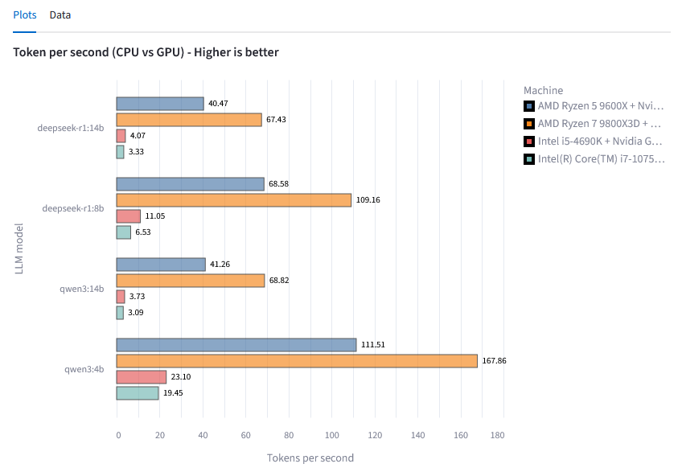

# AI & ML GPU Bench Suite for Python 


## Objective

> **One command → a full GPU/CPU benchmark & an interactive HTML report**

You can now measure your consumer **GPU** and/or **CPU** performance on **typical Artificial Intelligence and Machine Learning workloads** in a controlled way, with some **pre‑set reference results**.

The reproducible benchmarks cover:

- **Ollama LLMs** (token latency & throughput on various 3B → 14B parameter models)
- **XGBoost** (training & inference on the HIGGS dataset, on 100k → 10M+ rows)

Everything is orchestrated by a single YAML file (`ai_bench_suite.yaml`) and a runner script (`run_suite.py`), so you can launch an entire set of tests with one command.

Results are visible:

- **immediately at the end of the benchmark**, in a *notebook* that is automatically produced, with comparison against a handful of *reference systems*;
- **on a regularly updated Streamlit dashboard**, to better interact with a growing number of results: <https://ai-ml-gpu-bench.streamlit.app>

---

### What happens during a run

1. A unique **`run_id`** is generated.  
2. The benchmarks specified in the **configuration YAML file** are executed.  
3. The results of each test are recorded in two separate CSVs for **XGBoost** and **Ollama** (if both are selected).  
4. The Jupyter notebook is executed and exported to HTML; it opens automatically in the browser (the bars with a **thick border** are those from the just‑completed run).
5. If you’d like to help grow the *reference* result base, the two CSVs are **encrypted** (RSA 4096 bit) and uploaded to Filebin, submitting only technical data (opt-out available).  
6. On a daily basis, an ingestion process is run in order to import new results and make them available via Streamlit. More on the architecture underneath: <https://allaboutdata.substack.com/p/benchmarking-ai-and-ml-on-local-cpugpus>

---

## What to expect: two examples

4 GPUs compared on a few different LLMs via Ollama (Streamlit dashboard):  



XGBoost tested on 4 machines, each with the GPU enabled or not (Jupyter notebook):  


---

## Get started!

### Requirements

Make sure you have installed at least the **must‑have** components below

| Requirement                  | Why it’s needed                                   | How to install                                                                                                   | Required? |
|------------------------------|----------------------------------------------------|-------------------------------------------------------------------------------------------------------------------|-----------|
| **Python ≥ 3.13**           | Runtime for the scripts                            | <https://www.python.org/>                                                                                         | **Must**  |
| **uv 0.8.x**                | Super‑fast package manager & lock‑file generator   | <https://docs.astral.sh/uv/getting-started/installation/>                                                         | **Must**  |
| **CUDA ≥ 12.x**             | GPU benchmark (XGBoost + CuPy, Ollama)             | NVIDIA Driver + <https://developer.nvidia.com/cuda-downloads>                                                     | **Optional**<br><sub>(only if a GPU is selected in the YAML)</sub> |
| **Ollama** (running at http://localhost:11434) | LLM benchmark via REST API                      | <https://ollama.com/download>                                                                                     | **Optional**<br><sub>(only if you want to test LLMs)</sub> |
| **Ollama Models**           | Models specified in `ai_bench_suite.yaml`<br><sub>(comment models to exclude them, verify installation with `ollama list`)</sub> | <https://ollama.com/library>                                                                                      | **Optional**<br><sub>(only if you want to test LLMs)</sub> |


---

### Environment setup

In a local folder, just **clone this repository**:

```bash
git clone https://github.com/albedan/ai-ml-gpu-bench
```

Only if you don’t have a system Python 3.13.*, you can install it via **uv**:

```bash
uv python install 3.13 --default
```

---

### Configuration: `ai_bench_suite.yaml`

All benchmark parameters are here:

```yaml
machine_info:
  machine: "PC_AL_2025"       # Choose your synthetic host name
  cpu:    "AMD Ryzen 5 9600X" # Commercial CPU name
  gpu:    "Nvidia RTX 5060 16GB" # GPU name
```

- **Update** these three fields to match your machine.  
- **Comment / uncomment** the entries in the ``ollama`` section to include or exclude LLMs you haven’t downloaded.  
- For the LLMs you left uncommented, verify they’re available with ``ollama list``. You can install them with ``ollama pull [model_name]``.  
- Every combination listed in `rows` × `gpu` (for XGBoost) and `models` × `gpu` (for Ollama) is tried automatically.

---

### Execution

A single command reads the configuration YAML file and orchestrates the test execution, logging and result visualization.

Simply run:

```bash
uv run run_suite.py
```

The first run will download the needed dependencies.

### Privacy & Options

| 📦 | Detail |
|----|--------|
| **Result sharing** | Encrypted with a public/private key scheme and uploaded to Filebin (technical data only) |
| **Opt‑out results** | `--no-upload-results` skips encryption and upload entirely |
| **Suite selection** | `--suite` lets you choose `xgboost`, `ollama` or `both` (default) |

---

### Output

- **CSV**: result files `xgb.csv` and `ollama.csv` are written, one row per benchmark, with metrics and basic machine metadata.  
- **Notebook** (`bench_results_analysis_altair.ipynb`): executed and opened automatically in the browser. It lets you explore the newly obtained results and compare them with reference benchmarks.

---

## ❓ Q&A

| Q | A |
|----|--------|
| *Can I run just a subset of the benchmark?* | ✅ **Sure!** Just edit the file `ai_bench_suite.yaml`, for instance by commenting LLMs you don't want to try, or to run GPU or CPU only. |
| *I don't have a GPU. Is it for me as well?* | ✅ **Yes**, you can run the benchmark as it is (it will automatically skip the GPU benchmarks). |
| *Can I run the benchmark on an AMD GPU?* | 🟨 **Partially**, Ollama will leverage the GPU, while XGBoost will (likely) run on CPU only. |
| *I have an Nvidia GPU, but XGBoost runs on CPU only* | ℹ️ **Please verify the installation of CUDA toolkit** by running `nvidia-smi` and `nvcc -V` in a terminal. The first verifies the existence of an Nvidia GPU, the second shows the running CUDA toolkit. |

---

## 🔚 Thanks for testing!

If you find an issue or have an idea, **open an Issue** – or, even better, a **Pull Request**!  
Whenever possible, please keep result sharing enabled to help grow the *references*! 🚀

_Happy benchmarking and experimenting!_
