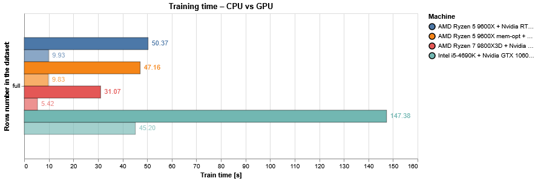

# AI & ML GPU Bench Suite for Python 


## Obiettivo

> **Un solo comando → un benchmark completo per GPU/CPU & un report HTML interattivo**

Ora puoi misurare le **performance** della tua GPU e/o CPU consumer su **workload tipici** di Machine Learning ed Intelligenza Artificiale, in maniera controllata e con alcuni **risultati di riferimento preimpostati**.

I benchmark riproducibili riguardano:

- **XGBoost** (train & inferenza su dataset HIGGS)
- **Ollama LLMs** (latency & throughput per token)

Il tutto è orchestrato da un singolo YAML (`ai_bench_suite.yaml`) e da runner (`run_suite.py`), così puoi lanciare un’intera batteria di test con un solo comando.

---

### Cosa succede durante una run

1. Viene generato un **`run_id`** unico.  
2. Vengono eseguiti i benchmark previsti dal file **YAML di configurazione**. 
3. I risultati di ogni test sono registrati in due CSV separati per **XGBoost** e **Ollama** (se selezionati entrambi).  
4. Se si vuole contribuire a far crescere la base dei risultati *reference*, i due CSV vengono **cifrati** (RSA 4096) e caricati su Filebin (link mostrato in console), fornendo solo dati tecnici.  
5. Il notebook Altair viene eseguito ed esportato in HTML **senza il codice**; si apre da solo nel browser (le barre con **bordo spesso** sono quelle della run appena terminata).

---

## Cosa ti aspetta: due esempi

4 GPU confrontate su 8 diversi LLM tramite Ollama.


XGBoost testato su 4 macchine, ciascuna con GPU abilitata o meno.


---

## Get started!

### Requisiti

Assicurati di aver installato almeno le componenti must tra le seguenti

| Requisito                  | Perché serve                                       | Come installare                                                                                                   | Necessario? |
|----------------------------|----------------------------------------------------|-------------------------------------------------------------------------------------------------------------------|-------------|
| **Python ≥ 3.13**          | Runtime per gli script                             | <https://www.python.org/>                                                                                         | **Must**    |
| **uv 0.8.x**                     | Gestore pacchetti & lock-file super-veloce         | <https://docs.astral.sh/uv/getting-started/installation/>                                                         | **Must**    |
| **CUDA ≥ 12.x**            | Benchmark GPU (XGBoost + CuPy, Ollama)             | Driver NVIDIA + <https://developer.nvidia.com/cuda-downloads>                                                     | **Optional**<br><sub>(solo se nel YAML è selezionata una GPU)</sub> |
| **Ollama** (in esecuzione su http://localhost:11434) | Benchmark LLM via REST API                         | <https://ollama.com/download>                                                                                     | **Optional**<br><sub>(solo se si vogliono testare gli LLM)</sub> |
| **Ollama Models**          | Modelli specificati in `ai_bench_suite.yaml`<br><sub>(commenta per escluderne alcuni, verifica installazione con `ollama list`)</sub> | <https://ollama.com/library>                                                                                     | **Optional**<br><sub>(solo se si vogliono testare gli LLM)</sub> |

---

### Setup ambiente (con uv)

```bash

# 0. Solo se non hai un ambiente Python di sistema versione 3.13.*
uv python install 3.13 --default

# 1. Crea l’ambiente virtuale
uv venv .venv
source .venv/bin/activate

# 2. Installa le dipendenze
uv sync
```

---

### Configurazione: `ai_bench_suite.yaml`

Tutti i parametri di benchmark vivono qui:

```yaml
machine_info:
  machine: "PC_AL_2025"     # Scegli il tuo nome host sintetico
  cpu:    "AMD Ryzen 5 9600X" # Nome commerciale CPU
  gpu:    "Nvidia RTX 5060 16GB" # Nome GPU
```

- **Aggiorna** questi tre campi in base alla tua macchina.
- **Commenta / decommenta** le voci nella sezione ``ollama`` per includere o escludere LLM che non hai scaricato.
- Per gli LLM che hai lasciato non commentati, verifica di averli disponibili con ``ollama list`` da terminale. Puoi installarli con ``ollama pull [nome_llm]``.
- Ogni combinazione elencata in `rows` × `gpu` (per XGBoost) e `models` × `gpu` (per Ollama) viene provata automaticamente.

---

### Esecuzione

Un solo comando che legge il file YAML di configurazione e orchestra l'esecuzione dei test, la registrazione e la visualizzazione dei risultati.

Semplicemente questo:

```bash
uv run run_suite.py
```

### Privacy & Opzioni

| 📦 | Dettaglio |
|----|-----------|
| **Condivisione risultati** | Crittografati con schema a chiave pubblica/privata e caricati su Filebin (solo dati tecnici) |
| **Opt-out risultati** | `--no-upload-results` permette di saltare in toto cifratura e upload dei risultati |
| **Selezione suite** | `--suite` permette di selezionare `xgboost`, `ollama` o `both` (default)|

---

### Output

- **CSV**: vengono scritti i file di risultati `xgb.csv` e `ollama.csv`, con una riga per benchmark, con metriche e metadati di base della macchina.
- **Notebook** (`bench_results_analysis_altair.ipynb`): viene eseguito e aperto nel browser in automatico. Permette di esplorare i risultati appena ottenuti e confrontarli con benchmark di riferimento.

## 🔚 Grazie per il test!
Se trovi un problema o hai un’idea, **apri una Issue** - o, meglio, una **Pull Request**!  
Nel possibile, lascia abilitata la condivisione dei risultati per far crescere le *reference*! 🚀

_Buon benchmark e buone sperimentazioni!_